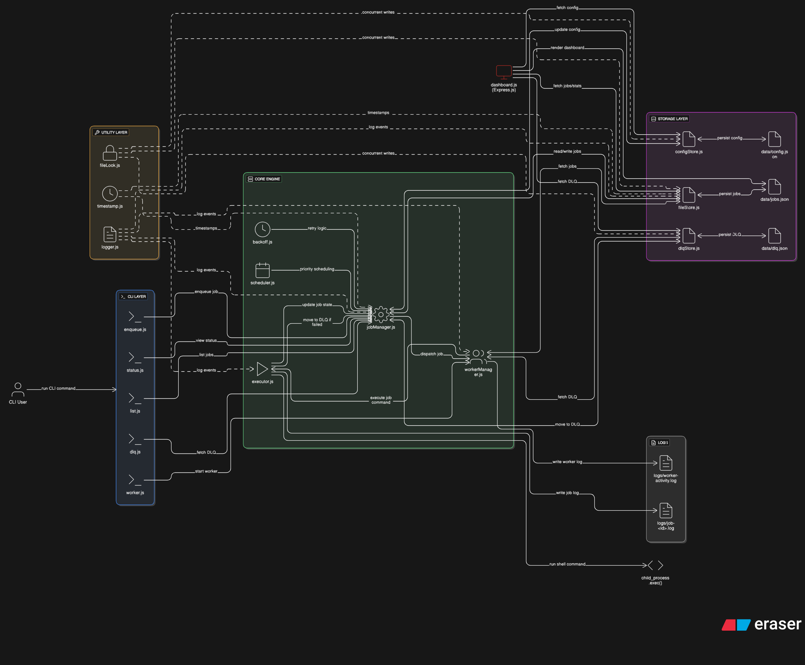

# QueueCTL - Background Job Queue System

> A fully functional, production-grade, CLI-based background job queue system built using Node.js.  
> It handles parallel job processing, automatic retries with exponential backoff, timeout management, and a Dead Letter Queue (DLQ) — with an integrated web dashboard for monitoring.

---

## Overview

QueueCTL is a command-line utility that simulates a scalable background job queue system.

### Key Capabilities
- Enqueue and manage background jobs
- Execute jobs concurrently using multiple workers
- Retry failed jobs automatically with exponential backoff
- Move permanently failed jobs to a Dead Letter Queue (DLQ)
- Persist job data across restarts using file-based storage
- Monitor everything in a web dashboard
- Configurable retry and backoff settings via CLI or file

---

## Tech Stack

| Component | Technology |
|------------|-------------|
| Runtime | Node.js (v20+) |
| CLI Framework | Commander.js |
| Logging | Winston |
| Storage | JSON file-based persistence |
| Job IDs | UUID |
| Web Dashboard | Express.js |
| Testing | Jest (ESM) |

---

## Project Structure

queuectl/
├── package.json              # Dependencies & scripts
├── README.md                 # Project documentation
├── queuectl.js               # CLI entrypoint (main command)
│
├── src/
│   ├── cli/                  # CLI command handlers
│   │   ├── enqueue.js        # Add new jobs
│   │   ├── worker.js         # Start/stop workers
│   │   ├── list.js           # List jobs by state
│   │   ├── status.js         # Status summary + dashboard launcher
│   │   └── dlq.js            # DLQ listing & requeue
│   │
│   ├── core/                 # Core logic (engine)
│   │   ├── jobManager.js     # Job creation, update, DLQ movement
│   │   ├── workerManager.js  # Multi-worker concurrency handling
│   │   ├── executor.js       # Command execution with timeout
│   │   ├── backoff.js        # Exponential retry delay
│   │   └── scheduler.js      # (Reserved for delayed jobs)
│   │
│   ├── storage/              # Persistence and config
│   │   ├── fileStore.js      # Read/write JSON safely
│   │   ├── configStore.js    # Manage retry/backoff settings
│   │   └── dlqStore.js       # Manage DLQ persistence
│   │
│   ├── utils/                # Helpers
│   │   ├── logger.js         # Winston-based logger
│   │   ├── timestamp.js      # ISO time helpers
│   │   └── fileLock.js       # Optional file write locking
│   │
│   ├── web/                  # Bonus feature: web dashboard
│   │   └── dashboard.js
│   │
│   └── constants.js          # Default paths and job states
│
├── data/                     # Persistent data directory
│   ├── jobs.json             # All jobs with state info
│   ├── dlq.json              # Dead Letter Queue entries
│   └── config.json           # Config (retries, backoff, etc.)
│
├── logs/                     # Job & worker logs
│   ├── job-<id>.log
│   └── worker-activity.log
│
└── tests/                    # Automated tests (Jest)
    ├── integration.test.js
    └── retryLogic.test.js

---

## Setup Instructions

1️ Clone and Navigate
git clone https://github.com/Harshith422/queuectl.git
cd queuectl

2️ Install Dependencies
npm init -y
npm install commander uuid winston express
npm install --save-dev jest eslint prettier

3️ Verify Setup
npm test

Expected output:
PASS  tests/integration.test.js
PASS  tests/retryLogic.test.js
Test Suites: 2 passed, 2 total

---

## Usage Examples

 Enqueue a Job

Option 1 — using a JSON file:
node queuectl.js enqueue job.json

Option 2 — inline JSON:
node queuectl.js enqueue "{\"command\":\"echo Hello from QueueCTL\"}"

 Output:
Job added to queue: 2b3f4a56-cd90-4a23-9f21-e32b3e9f7b0d (priority 3)

---

 List Jobs
node queuectl.js list

 Output:
┌─────────┬────────────────────────────┬───────────────┬────────────┬────────┬──────┐
│ (index) │ id                         │ command       │ state      │ retries│ ...  │
└─────────┴────────────────────────────┴───────────────┴────────────┴────────┴──────┘

---

 Start Worker(s)
node queuectl.js worker:start --count 2

 Output:
Worker 1 picked job <id> (priority 5)
Job <id> failed. Retrying in 2000ms (attempt 1/3)
  Job <id> moved to DLQ
  Worker completed job <id>

---

 Check Queue Status
node queuectl.js status

 Output:
 Current Queue Summary
┌─────────┬─────────┬────────────┬───────────┬────────┬──────┐
│ pending │ processing │ completed │ failed │ dead │
└─────────┴────────────┴───────────┴────────┴──────┘

---

 View Dead Letter Queue
node queuectl.js dlq:list

 Output:
┌─────────┬──────────────────────┬──────────┬────────────────────────────┐
│ id      │ command              │ attempts │ last_error                 │
└─────────┴──────────────────────┴──────────┴────────────────────────────┘

---

 Retry DLQ Job
  node queuectl.js dlq:retry <job-id>

 Output:
  Job <job-id> requeued from DLQ.

---

 Launch Web Dashboard
node queuectl.js dashboard

 Output:
 QueueCTL Dashboard running at http://localhost:3000

Visit http://localhost:3000 to visualize:
- Job summary (Pending, Completed, DLQ)
- Recent jobs with priorities
- DLQ error table
- Auto-refresh (every 5 seconds)

---

##  Job Lifecycle

pending — waiting to be picked  
processing — being executed  
completed — job executed successfully  
failed — failed, retryable  
dead — permanently failed (in DLQ)

---

##  Retry & Backoff Logic

delay = base ^ attempts (in seconds)

Example (base = 2):
Attempt | Delay
1 | 2s
2 | 4s
3 | 8s

---

##  Configuration

Edit `data/config.json`:
{
  "maxRetries": 3,
  "backoffBase": 2
}

maxRetries: Max retries per job (default 3)
backoffBase: Base value for exponential backoff (default 2)

---

## Bonus Features Implemented

Timeout Handling — stops long-running jobs  
Priority Queue — workers process higher-priority jobs first  
Web Dashboard — Express-based visual dashboard  
Job Output Logging — stored in /logs/job-<id>.log  
Queue Metrics — visible in status command & dashboard

---

##  Testing

npm test

 Output:
PASS  tests/integration.test.js
PASS  tests/retryLogic.test.js

---

##  Architecture Overview

CLI (src/cli): Handles commands  
Core (src/core): Job engine, retry, DLQ, workers  
Storage (src/storage): File persistence and config  
Utils (src/utils): Logging, timestamps, locks  
Web (src/web): Express-based dashboard

You can check the Project Architecture in Repo
---

##  Demo Video

Demo Video Link Below:
https://drive.google.com/file/d/1Bn3eCWavBf3QHTtjWsGLfSIpGO-N_7Dz/view?usp=sharing

---

##  Evaluation Checklist

 CLI operations  
 Retry & DLQ  
 Persistent storage  
 Config management  
 Worker concurrency  
 Modular design  
 Test coverage  
 Bonus features (timeout, priority, dashboard)

---

## Author

Harshith P  
B.Tech Artificial Intelligence Engineering  
Amrita Vishwa Vidyapeetham 
Email: potnuriharshith@gmail.com

---

## License

MIT License © 2025 — Built by Harshith P
